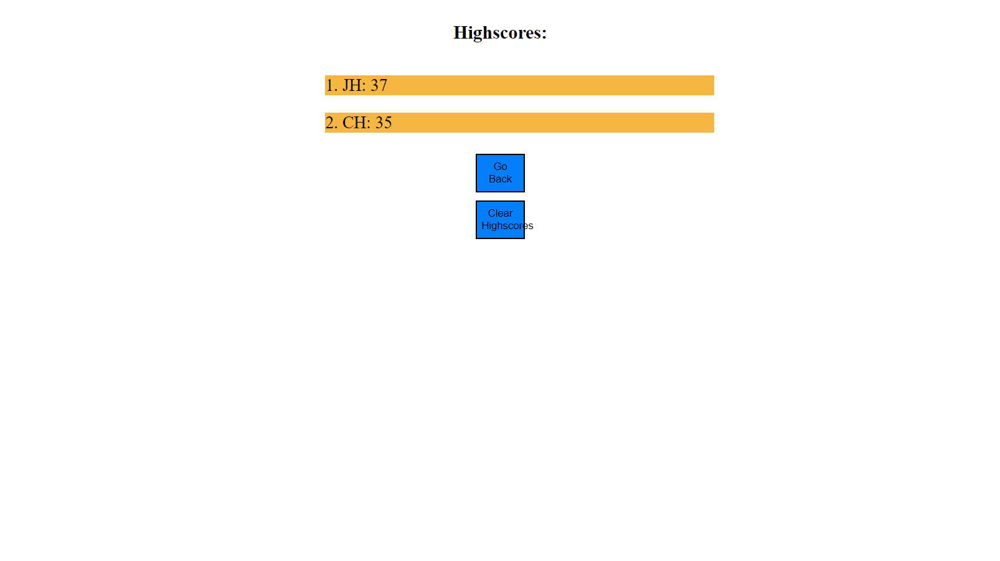

# JavaScript Code Quiz

## Description

This project is designed to help students that are learning JavaScript, a website that allows them to test their knowledge on javascript.

## Installation

N/A

## Usage

When you are on the homepage you will be presented with the instuctions and a start button. When the start button is clicked a multiple choice question will appear with a timer in the top right corner. If you get a question incorrect the timer will decrease by 10 seconds. When all questions are completed you will enter your initials where your score will be logged. You are then presented with a highscores screen where you can click the "go back" button to take the quiz again or "clear highscores" to clear all the highscores.

https://harljos.github.io/javascript-code-quiz/

## Credits

N/A

## License

N/A
